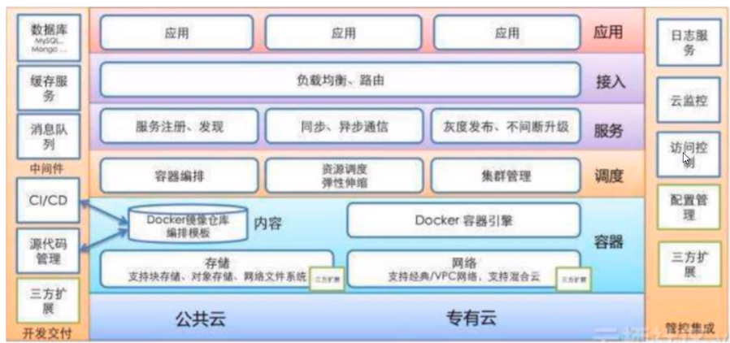
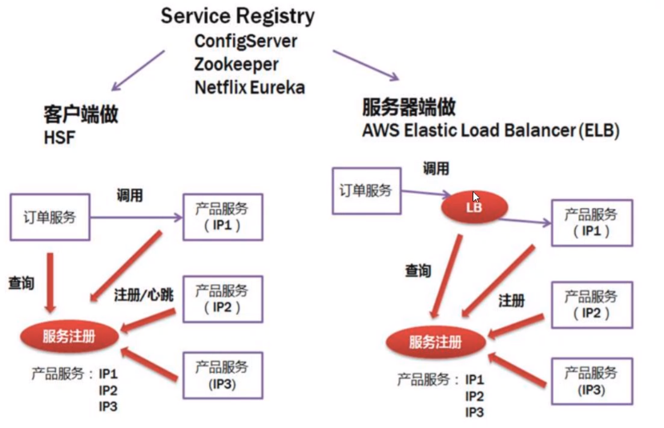
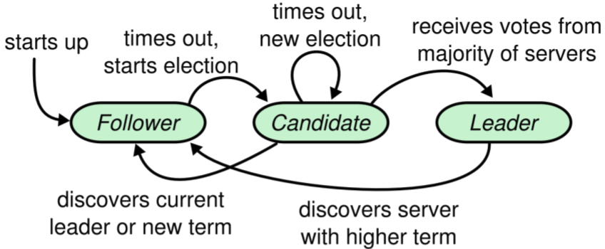
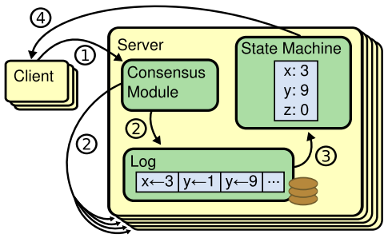
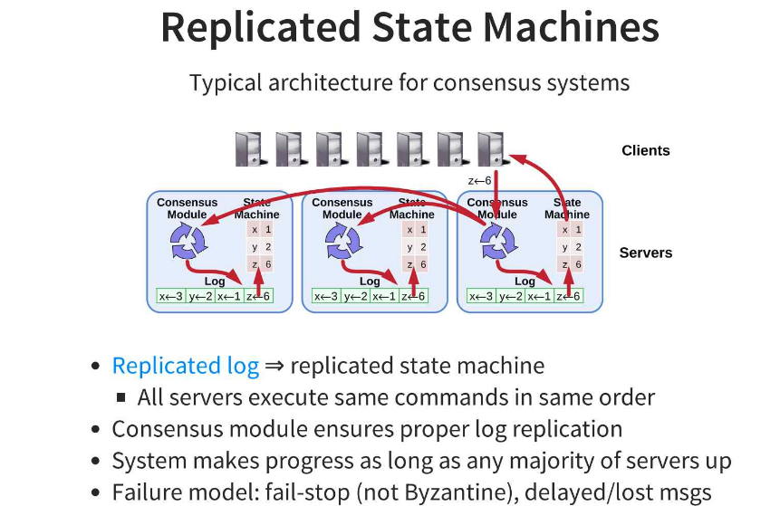

# Go-Micro-service
Go Micro service Go微服务 入门
微服务生态

### 分层
- 硬件层   k8s docker 
- 通信层 prc
- 应用平台层  监控
- 微服务层 服务业务逻辑的实现
### 硬件层
- 物理服务器管理
- 操作系统管理
- 配置管理
- 资源隔离和抽象
- 主机监控和日志
### 通讯层
- 网络传输-
- RPC
- 服务发现
- 服务注册
- 负载均衡
- 消息传递
#### 网络传输
- HTTP + RESTFUL
    - GET POST PUT DELETE
- TCP RPC 调用
    - Thrift
    - Dubbox
    - Grpc
- 消息传递
    - json
    - thrift
    - protobuf
#### 服务注册发现
- 分布式数据存储
    - consul
    - etcd
    - zookeeper
#### CAP原理
- C ：consistency 每次总是能够读到最近写入的数据或者失败
- A：available 每次请求都能够读到数据
- P：partition tolerance 系统能够继续工作，不管任意个消息由于网络原因失败
保证P的情况下选择C or A

### 支撑平台
- 私有云平台
- 服务管理平台
- 监控报警平台
- 测试&构建&发布平台
- 日志检索平台
- 服务治理平台
- Metrics平台

# 微服务架构
- 微服务架构全景图
- 服务注册和发现
- raft协议基本概念
- raft协议leader选举详解
- raft协议日志复制详解
- raft协议safefy详解
- rpc调用个服务监控

### 微服务架构全景图

### 服务注册和发现
- Client side implement
    - 调用需要维护所有调用服务地址
    - 有一定的技术难度，需要rpc框架支持
- Server side implement
    - 架构简单
    - 有单点故障
- 问题：在微服务架构中，为什么不选择传统的lvs方案？

#### 注册中心
- etcd注册中心
    - 分布式一致性系统
    - 基于raft一致性协议
- etcd使用场景
    - 服务注册和发现
    - 共享配置
    - 分布式锁
    - Leader选举
- 服务注册和发现的思考
    - 一定需要一致性吗？
    - Eureka 是一个AP系统，netflix开发用后来作高可用的注册中心
    
### Raft协议
- 应用场景
    - 解决分布式系统一致性的问题
    - 基于复制的
- 工作机制
    - leader选举
    - 日志复制
    - 安全性
#### Raft协议 基础概念
- 角色
    - Follower 从
    - Leader 主
    - Candicate 候选者
- Term(任期)
    - 在raft协议中，将时间分为一个个term(任期)
        - 先选举一个leader 然后就是任期，如果这个leader一直没有故障他就一直三leader，反之下台，再选举
            - 如果没有选出来，就再选举，知道选出为至

- 复制状态机
    > 我们知道，在一个分布式系统的数据库中，如果每个节点的状态一致，每个节点都执行相同的命令序列，那么最终他们会得到一个一致的状态。
    也就说，为了保证整个分布式系统的一致性，我们需要保证每一个节点执行相同的命令序列，也就算说，每个节点的日志要保持一样。所有说，保证日志
    复制一致性就算Raft等一致性算法的工作了

- 心跳(heartbeate) 超时 (timeout)
    - 在raft算法中，有两个timeout机制来控制领导人选举举例：
        - 一个三选举定时器(eletion timeout)：即Follower等待策划嗯为candidate状态的等待世界，这个世界被随即设定为150ms～300ms之间
        - 另一个是headrbeat timeout：在某个节点策划嗯为ieleader之后，他会发送一个append entries消息个ie其他节点，这些消息就算通过headrbeat timeout来
        传送，follower接受到leader的心跳包同时也重置选举定时器

### raft协议leader选举详解
- 触发条件
    - 一般情况下，追随者接受到领导者的心跳时，把选举定时器清零，不会触发
    - 追随者的选举定时器超时发生时(比如leader故障了)，会变成候选者，触发领导人选举
- 选举过程
    - 一开始，所有节点都斯以follower角色启动，同时启动选举定时器（时间随机，降低冲突）
- 选举过程
    - 当定时器到期时，变为candidate角色
    - 把当前任期+1，并为自己进行投票
    - 发起RequestVote的RPC请求，要求其他的节点为自己投票
    - 如果得到半数以上节点的统一，就会成为leader
    - 如果选举超时，还没有leader选出，则进入下一个任期，重新选举
- 限制条件
    - 每一个节点在一个任期内，最多能给一个候选投票，采用先到先服务原则
    - 如果没有投过票，这比candidate的log和当前节点的log那个更新，比较方式为谁的lastlog的term越大越新，如果相同，谁的lastlog的index越大谁越新。
    如果当前接待年更新，则拒绝投票
    
### 日志复制
- Client向leader提交指令(如：set 5)，leader收到指令后，将命令追加到本地
的日志记录中。此时，这个命令处于“uncomitted”状态，复制状态机不会执行该命令
- leader将命令（set 5）并发复制给其他节点，并等待且他节点将命令写入到日志中，
如果此时有些节点失败或在比较慢，leader节点会一直重试，直到所有节点都保存了命令
到日志中。只有leader节点就会提交命令（即被状态机执行命令，这里所：set 5），并将
结果返回个ieclient节点
- leader节点杂子提交命令后，下一次心跳包中就带有通知其他节点提交命令的消息，
其他节点收到leader的消息后，将命令应用到状态机（state machine）最终每一个
节点的日志都保持了一致性

课后学习：http://thesecretlivesofdata.com/raft/

### 安全性
- 一个candidate节点要成为赢得选举，就需要跟网络中大部分节点进行通讯，这就意味着
每一条已经提交的日志条目最少在其中一台服务器上出现。如果候选人日志至少和大多数服务器
上的日志一样新，那末它一定包含有全部的以及提交的日志条目。Requestote PRC实现了这个现在：
这个RPC包含候选人日志的信息，如果它自己的日志比候选人日志要新，那么它会拒绝候选人投票的请求
- 最新判断标准
    - 如果两个日志的任期号不同，任期号大的日志内容更新
    - 如果任期号一样大，则更具日志中最后一个命令的索引index，谁大谁最新
    
### RPC调用
- 数据传输
    - Thrift 协议
    - Protobuf 协议
    - Json 协议
    - msgpack 协议
- 负载均衡
    - 随机算法
    - 轮询
    - 一致性hash
- 异常容错
    - 健康检查
    - 溶断
    - 限流
#### 服务监控
- 日志收集
    - 日志搜集端->kafka集群->数据处理->日志查询和报警
- Metrics打点
    - 事实采样服务的运行状态
    - 直观的报表展示
