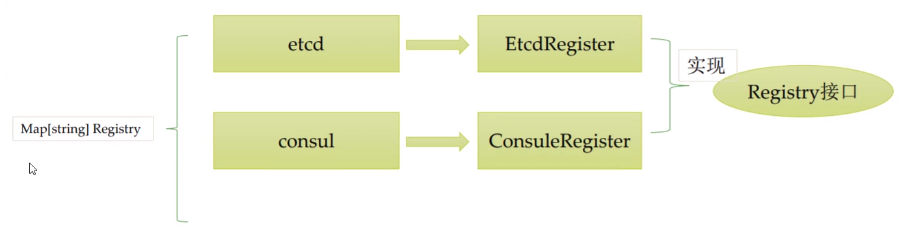

注册中心
===
>注册中心可以说是微服务架构中的”通讯录“，它记录了服务和服务地址的映射关系。在分布式架构中，服务会注册到这里，当服务需要调用其它服务时，就到这里找到服务的地址，进行调用。

### 选项摸索简介
- 问题描述
``` 
type Options struct {
    StrOption1 string
    StrOption2 string
    StrOption3 string
    IntOption1 int
    IntOption2 int
    IntOption3 int
}
```
给每一个赋值
```
package main

import "fmt"

type Options struct {
	StrOption1 string
	StrOption2 string
	StrOption3 string
	IntOption1 int
	IntOption2 int
	IntOption3 int
}

type OptionFunc func(opts *Options)

func InitOption(opfs ...OptionFunc) {
	option := &Options{}
	for _,opf := range opfs {
		opf(option)
	}
	fmt.Println(option)
}

func WithStingOption1(str string) OptionFunc {
	return func(opts *Options) {
		opts.StrOption1 = str
	}
}

func WithStringOption2(str string) OptionFunc {
	return func(opts *Options) {
		opts.StrOption2 = str
	}
}

func main() {
	InitOption(WithStingOption1("hello"),WithStringOption2("asdasdasd"))
}

```

### 注册组建设计
- 目标
    - 支持多注册中心
    - 支持可扩展
    - 基于接口的设计思路
    - 基于插件的设计思路
- 接口定义
    ``` 
    type Register interface {
        Name() string // 插件名词
        Init(opts ...Option)  // 初始化注册组建
        Register(ctx context.Context,service *Service) // 注册
        Unregister(ctx context.Context,service *Service) // 反注册
    }
    ```
- 数据结构定义
    ``` 
    // 服务抽象
    type Service struct {
        Name string
        Nodes []*Node
    }
    
    // 服务节点的抽象
    type Node struct {
        Id string
        IP string
        Port int
    }
    ```

#### 基于插件的设计思路
- 插件抽象
    - 实现了Registry接口，就是一个注册插件
        - 基于etcd的注册插件
        - 基于consul的注册插件
        - 基于zookpeeper的注册插件
    - 插件管理
        - 提供Registerlugin函数，用来注册插件
        - 基于名字对插件进行管理
        - 插件初始化，通过名字对插件进行初始化
- 插件管理
    - 插件查找
        - 通过名字查询到对应的插件，并返回
        - 调用方通过返回的插件实现操作注册和发现


